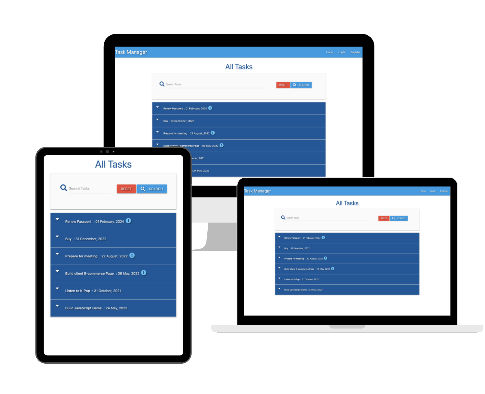

# Code Institute - Task manager application

This is a solution to the a challenge from the [Code Institute
](https://codeinstitute.net/) Backend Module to create a task manager application. 

## Overview

### Links

- [Repo](https://github.com/Franciskadtt/flask-task-manager)
- [Live site](https://smart-task-manager.herokuapp.com/)

### Built with

- HMTL
- CSS 
- Javascript
- Python
- MongoDB
- Flask
- Materialize

### What I learned

-  I learned how to perform create, read, update, and delete calls (CRUD calls) to a Mongo database in the context of a Flask application.
- How to create an HTML-based user interfaces to demonstrate these CRUD calls in action.
- To style the user interface using the Materialize framework.
- Using one of dependencies that come with Flask, I learned rudimentary user authentication and authorization.
- How to build a basic search function.

### Features

- The home page of our task manager application displays a summary of tasks.
- That summary information is comprised of the task name, due date, whether or not it's an urgent task, and can be clicked to expand more, see the task category, description, and creator.
- Users will be able to register, see their profile, log out, and log back in again. 
- Registered users will also be able to add a new task, which includes selecting a due date using Materialize's datepicker component, and toggling a switch to mark the task as urgent.
- Users will also be able to edit tasks, but will only be permitted to edit their own tasks, not any of the tasks submitted by others.
- In addition to editing their tasks, users will be able to delete their own tasks as
well.
- Whether a user is logged in or not, have a basic search function, which will filter tasks based on the user's query.
- The user can manage the task categories list, but make it secure to only be available to an Admin user.
- Be fully responsive by using their grid-based classes.

## Acknowledgements

- All content and images were provided by [Code Institute](https://codeinstitute.net/)

